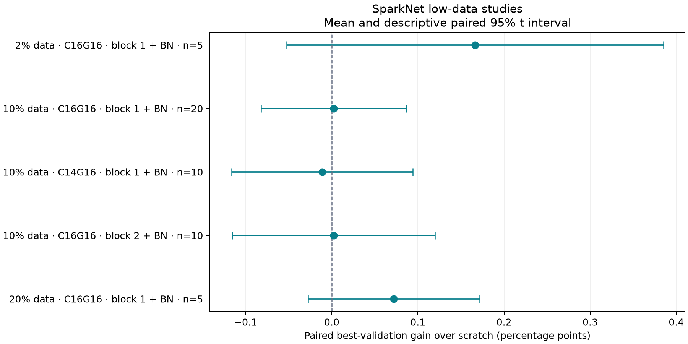
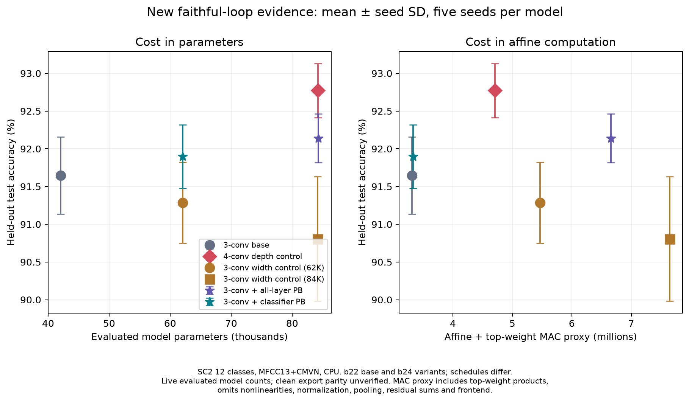

# PerforatedAI dendrites: evidence review across all recorded runs

Research started 2026-10-03. This new document was written throughout a three-agent audit of existing experiments. The synthesis below incorporates the raw-artifact checks; the chronological reading log follows it. No training was launched.

## Conclusions from the current evidence

**PerforatedAI dendrites have produced real, repeatable improvements in some models here. Their value depends strongly on the base architecture, placement, training policy, and the comparison used. The local evidence does not support a general accuracy or compression advantage across models.**

1. **The strongest current positive result is selective classifier expansion on a three-convolution CNN.** In CPU b24, classifier-only PB/tanh reaches **91.898% held-out test**, versus **91.284%** for the approximately parameter-matched widened CNN: **+0.613 percentage points**, descriptive paired 95% interval **[+0.159,+1.068]**, positive at all five seeds. The evaluated models have 62,076 versus 62,041 parameters, and an affine-plus-top-weight proxy of 3.332M versus 5.469M MACs. The proxy advantage is about 39%; it is not measured device speed. This supports the specific classifier placement and recipe. A comparably sized deeper control for this classifier-only arm is queued but has no result yet.
2. **All-layer expansion has not established a better accuracy/cost frontier.** The b24 all-layer model averages 92.139% test at 84,288 parameters and 6.659M proxy MACs. A plain four-convolution control averages **92.773%**, uses **84,250** parameters and **4.708M** proxy MACs. It wins at all five seeds; PB-minus-depth is −0.634 pp, interval [−1.031,−0.237]. Under these scores and operation estimates the depth control dominates the all-layer PB model. Device costs and clean export parity remain unmeasured for this family.
3. **SparkNet's strongest low-data growth comparison is essentially flat.** At 10% training data, C16g16 block1+BN growth has **+0.002 pp** best-validation gain across **20 paired seeds**, interval **[−0.082,+0.087]**. Its active branch adds 7.34% parameters and 7.42% local MACs. Smaller 2% and 20% studies have positive means with intervals including zero. Low data has not demonstrated an accuracy advantage under these SparkNet recipes.
4. **Pruning then perforating recovers accuracy, but recovery is often mostly continuation and extra capacity.** Across 102 completed SparkNet PTP candidates, correcting classifier costs and comparing with the zero-dendrite size curve makes the pooled adjusted test effect negative in all three parent families. The supplied paper's positive ResNet/Pets result has therefore not transferred to this SparkNet protocol. The numerical pools include correlated pruning rates and some severely damaged models; inspect the per-rate results before interpreting magnitude.
5. **The older DS-CNN headlines overstate the isolated dendrite increment.** The legacy w18 +4.96 pp validation recovery contains +3.49 pp before adding a dendrite and +1.47 pp afterward. A later w18 recipe gains only +0.096 pp after its zero-dendrite architecture. Neither has a held-out dendritic test control.
6. **Several reporting issues change cost or attribution.** The faithful driver scores a live model but counts an unverified cleaned copy that loses single-dendrite coefficients. Historical classifier MACs miss copied dot products; PTP analysis omits combination coefficients; broader SparkNet test FAR/FRR treats all 12 classes as keywords. Accuracy itself is not invalidated by these cost/metric errors. This review corrects derived research artifacts and preserves the original runs.

These conclusions describe the models and protocols already run. They are not a proof that PB is superior to ordinary gradient descent: available PB-versus-GD comparisons do not establish that distinction.

## Where to read the evidence

| Research notebook | Coverage |
|---|---|
| [SparkNet growth and architecture](dendrite-impact-2026-10-03/sparknet-growth-and-architecture.md) | Original architecture and author checkpoints; all v2/v3/low-data/documented PAI arms; shams; native SparkNet; test semantics; firmware and ReRAM evidence |
| [SparkNet pruning and PTP](dendrite-impact-2026-10-03/sparknet-pruning-and-ptp.md) | All seven pruning families, 28 run roots, 102 completed PTP candidates, interrupted placements, physical clean costs, size-adjusted curves and seed-cluster bootstrap |
| [Faithful loop and newer architectures](dendrite-impact-2026-10-03/pai-faithful-and-new-architectures.md) | All 267 evaluated results and 25 partial/failed directories; b21–b24; 211 native students; complete arm tables, paired effects and queue provenance |
| [Historical DS-CNN and papers](dendrite-impact-2026-10-03/historical-dscnn-and-paper-context.md) | Direct historical DS-CNN candidates, corrected MACs, supplied paper context and current primary PerforatedAI papers |
| [Source census](dendrite-impact-2026-10-03/source-artifact-census.csv) / [summary](dendrite-impact-2026-10-03/source-artifact-census-summary.json) | 4,646 canonical source artifacts with paths and SHA256 at the recorded snapshot; counts are artifacts, not independent runs |

## What a PerforatedAI dendrite changes

A selected layer gains a parallel nonlinear branch and learned output combination weights. Schematically, for one branch:

`output = base_layer(input) + top_weight * activation(dendrite_layer(input))`

The multiplication is per output neuron/channel. The branch copies the selected module's connectivity and has its own weights; later branches can take earlier branch outputs as additional inputs. The exact wrapper topology matters for both cost and gradient flow.

The training loop alternates two jobs:

1. **Neuron phase:** train the base and combination weights on the task loss. Accepted dendrite input weights are frozen under the PB method.
2. **Candidate/PB phase:** hold the base optimizer weights fixed, learn nonlinear candidates against local residual-error/correlation signals, then try integration and return to neuron training. Selection, rejection, retries and rollback determine which branches survive in the selected model.

For the implemented PB hook mechanism, **excluding base parameters from the candidate optimizer is different from setting all base `requires_grad=False`**. Error hooks still need the autograd graph. The current local pipeline explicitly guards against severing that path; base BatchNorm running statistics are separately pinned. Candidate-phase flat base validation is expected while an unintegrated candidate is being trained. It cannot, by itself, diagnose PB failure.

The GD mode uses PAI's adaptive branches with ordinary gradient training instead of PB. Native restricted-fan-in, DTNet, DNN, and multiscale dendrites in other student files are fixed architectures jointly trained by gradient descent. They are useful controls and architectural context, but are not evidence for PerforatedAI dendrites.

### Why different comparisons answer different questions

| Comparison | What it establishes | What remains mixed in |
|---|---|---|
| Final versus pruned model immediately after surgery | Total recovery | Ordinary fine-tuning, pregrowth PAI training, capacity and schedule |
| Final versus its best zero-dendrite architecture | Recovery after the pregrowth baseline | Extra training/reset/selection opportunities and added parameters |
| Growth versus same-seed scratch with matching initial trajectory | Effect of the executed growth policy | Candidate pause, random-stream changes and optimizer events |
| Real growth versus zero-output sham | Increment beyond that sham's perturbations | Sham must match placement, timing, restart and random streams |
| Parameter-matched width/depth control or interpolated size reference | Whether the chosen added capacity beats a conventional alternative | Architecture shape, compute, optimizer suitability and interpolation assumptions |
| PB versus GD with the same branch topology | Evidence about the PB learning rule | Small samples and potentially different training/selection trajectories |
| Turning off a trained dendrite | Dependence of the co-adapted model on the branch | It does not measure gain over an independently trained model |

No single difference should be called “the dendrite effect” without identifying its reference.

## SparkNet: architecture and why placement matters

SparkNet is a small temporal network from [*Sparse Binarization for Fast Keyword Spotting*](https://www.isca-archive.org/interspeech_2024/svirsky24_interspeech.pdf). The local reference uses 32 MFCC bins as input channels, four time/channel-separable blocks (kernel widths 11,15,19,29), residual paths on the last three, and a learned gate bank. The gate is convolution → BN → tanh; training adds Gaussian noise, then the shifted gate is clamped to [0,1]. Time-averaged gate occupancy feeds the 12-class linear classifier. The sparsity objective penalizes gate-opening probability. This architecture already supplies nonlinear processing and regularization; another branch may overlap what it can learn.

From the unchanged reference topology, with trunk width C, gate width G, 32 inputs and 12 classes, affine parameter count is:

`P(C,G) = 6*C² + 109*C + 364 + (C+15)*G`

It includes trainable BN affine parameters and excludes BN buffers. The C16,G32 reference has **4,636 parameters / 396,304 local MACs**. Published MACs are **454.5K under THOP's broader convention**. Those counts describe different operation conventions, not a reproduced speed discrepancy.

All four released author checkpoints strict-load into the local topology. They contain C4/C8/C16/C32 with **1,504/2,356/4,636/11,500 parameters**, 32-input/32-gate topology. The [author repository table](https://github.com/jsvir/sparknet) reports 1,416/2,292 for C4/C8; that discrepancy already exists between the published table and released checkpoints. It is not evidence that this port introduced the additional parameters.

The original paper's speed comparison is expressed in MACs, not board latency. Its gate ablation removes noise, clipping and the sparsity term together, so the accuracy difference cannot isolate sparsity regularization alone. Local experiments preserve their own frontend, balancing and operation convention rather than inheriting the paper's test scores.

Classifier-only growth is cheap in computation because the classifier runs **after time pooling**. It can be expensive in parameter percentage because the base is tiny. One classifier dendrite adds 408/216/120 clean parameters at G32/G16/G8; three add 1,260/684/396. Trunk pruning at fixed G leaves this classifier-copy cost fixed. This differs from the supplied ResNet paper, where shrinking the classifier's input dimension also shrinks dendrite cost.

Temporal placements repeat branch computation at every frame. Grouping a pointwise branch with BN changes its input/output scale before its activation; this is consequential for tanh saturation and residual compatibility. The better-run normalized v3 placements have small gains in a few full-data groups, but the sham-adjusted evidence is weak or near zero. This is a plausible scale/placement explanation, supported by implementation checks; it is not established as the sole cause of outcomes.

### Growth evidence and its coverage

- **v2:** 291 manifests: 141 scratch runs and 150 completed control/placement arms (six widths × five seeds × five arms). All 24 dendritic placement-by-width mean validation effects versus continuation are negative, with descriptive paired intervals below zero. 117/120 selected dendritic models retain active branches. Integration failure does not explain the overall result. Its optimizer/schedule handoff differs from scratch; it tests that workflow.
- **v3:** 187 manifests, with 183 growth reports; **low-data:** 45/158/15 manifests at 2%/10%/20%, with 10/74/5 growth reports. The detailed inventory records missing and partial artifacts. Among 262 complete growth/scratch pairs, 261 match every pre-switch validation epoch exactly; the exception is a KD pilot with a different loss.
- A `fc-sham` can have one structurally retained branch and increased parameter/MAC cost while top weights are zero and on/off outputs agree. Structural count does not establish functional benefit.
- The v2 test report evaluates 60 scratch/continuation models and no dendritic arms. The broader v3 report has 11 unique dendritic evaluations but no complete matched scratch test series, and scores `final_clean_pai.pt` while attaching best-validation metadata. Best and final checkpoints must remain distinct.
- **Documented PAI controls:** all 13 manifests and their stage reports are included in the growth notebook. **Native SparkNet:** 60 completed runs are reported separately from PAI. **Paper replication:** 10 manifests, eight epoch logs, six summaries; incomplete/reference rows are identified separately.

[Editable SVG](dendrite-impact-2026-10-03/sparknet-lowdata-paired-effects.svg). Intervals concern paired seed variation in epoch-selected validation scores; they are not held-out test intervals.

## Faithful CNN: where the positive evidence survives controls

The faithful driver uses a different architecture and representation: a two-dimensional CNN over the first 13 MFCC coefficients plus CMVN, Gaussian training noise, and a 12-class SC-v2 task. Its selected live models are evaluated on a fixed-seed 4,890-example test set. Main/b21 use MPS; b22–b24 use CPU. Pooling their results as independent replications would be misleading.

| Selected arm, five seeds each | Evaluated parameters | Affine + top proxy MACs | Test mean ± seed SD |
|---|---:|---:|---:|
| b22 three-conv base c12x32x64 | 42,084 | 3,312,492 | 91.644 ± 0.511% |
| b24 same base + classifier PB | 62,076 | 3,332,472 | **91.898 ± 0.421%** |
| b24 widened three-conv c16x41x82 | 62,041 | 5,469,216 | 91.284 ± 0.535% |
| b24 same base + all-layer PB | 84,288 | 6,658,832 | 92.139 ± 0.324% |
| b24 widened three-conv c17x50x100 | 84,182 | 7,643,139 | 90.806 ± 0.824% |
| b24 plain four-conv c12x32x64x94 | **84,250** | **4,708,164** | **92.773 ± 0.358%** |

All-layer PB exceeds the width control by +1.333 pp, but its interval [−0.035,+2.701] crosses zero. Classifier-only PB exceeds the b22 same-base mean by +0.254 pp, interval [+0.041,+0.466], with +19,992 parameters. b24 versus b22 is cross-batch; their initial training trajectories match exactly until first restructuring at each seed, supporting that control, while their full stopping budgets differ.

The main two-layer PB/tanh result improves test accuracy **+2.937 pp** over its small c8x16 base but approximately doubles parameters. Against the near-cost widened c16x32 control the gain is **+0.282 pp**, interval [−0.251,+0.816]. Fixed restart controls further reduce the apparent advantage. CPU b22 adds depth at similar parameter cost and achieves much higher accuracy, though with more compute. CPU b23 repeats the pattern: PB improves its small three-layer bases but loses to approximately equal-parameter wider models. Full tables and 98 pairwise/budget comparisons are in the faithful notebook.

**PB-specific advantage is unresolved.** The main low-width PB/GD test difference is −0.016 pp, interval [−2.696,+2.663]; at 20% data it is +0.147 pp, interval [−0.780,+1.075]. These comparisons cannot distinguish a benefit from adaptive nonlinear capacity/optimization from a benefit unique to the PB objective.

[Editable SVG](dendrite-impact-2026-10-03/faithful-accuracy-and-cost.svg). Error bars show sample SD across five seeds. Estimated MACs omit normalization, nonlinearities, pooling, residual sums and frontend extraction. Parameter counts describe scored live models; their cleaned exported accuracy has not been verified.

## Pruning then perforating: local result versus paper result

The supplied paper reports a positive parameter-adjusted test effect on half-width pretrained ResNet-18/Pets: +1.15 pp across 54 L2-pruned runs, with the largest benefits under severe pruning. Its head-only cost is comparatively small, and its curve is interpolated in **log10 parameters**. The paper is a submission under review, not a local replication.

The local SparkNet PTP audit covers **102 completed candidates**: C16/G32 (42; seven rates × six seeds), C16/G16 (30), and C18/G8 (30), the latter two six rates × five seeds. They use classifier-only sigmoid PB, at most three dendrites, no KD, no label smoothing, no post-PAI resume. Validation selects the checkpoint; per-epoch clean-train/test scores are logged.

| Parent family | Adjusted test gain, all rates | Seed-cluster bootstrap 95% interval | Strictly in-range rates: adjusted test gain |
|---|---:|---:|---:|
| C16/G32 | −7.497 pp | [−8.257,−6.885] | −12.189 pp (40–70% pruning) |
| C16/G16 | −2.924 pp | [−3.133,−2.753] | −4.028 pp (30–60%) |
| C18/G8 | −1.228 pp | [−1.343,−1.124] | −1.476 pp (20–60%) |

These are observational selected-epoch comparisons against each family's zero-dendrite size curve, with **corrected clean parameter coordinates and canonical PAI checkpoint selection**. Every canonical architecture row maps uniquely to a neuron-phase epoch using its parameter count, validation score and recorded training score; all 102 selected costs and validation scores agree with final reports. The associated epoch test score is used, without rerunning models. The all-rate version uses the paper-style flat upper endpoint where a grown model exceeds the available size range. No unpruned parent appears in this local zero-dendrite curve; extrapolated light-pruning rows are especially weak comparisons. Restricting to shared in-range rates still yields negative family means. The bootstrap resamples whole parent seeds and refits the curve (10,000 draws); rate cells are not treated as independent replicates.

The large C16 loss includes exceptionally damaged C3 runs whose initial FT accuracy is 7.58% and 18.99% at two seeds. That pooled value is not the typical loss at every rate. Per-rate tables show near-zero light-pruning means and negative heavier-rate means. Same-gate conventional scratch mean rows also frequently exceed final candidates at no greater parameter/MAC cost; those are descriptive frontier comparisons, not matched causal tests.

The older C16 classifier family has headline recovery of +2.50/+5.19/+8.12 pp at C12/C10/C8, but only +0.19/+0.35/+0.66 pp after the corresponding zero-dendrite architecture. Its source-seed labels mask continuation seed0; the cohort can change at handoff. Earlier C12 unlimited and C16 gate-conv arms are interrupted and must not be treated as completed null or positive experiments.

The original offline analyzer selects across all epochs, including candidate-training (`p`) snapshots. Fourteen of 102 of those selections disagree with final reports (13 validation and nine cost mismatches, overlapping); all 14 choose a candidate-training epoch. The final table above uses canonical PAI architecture rows and their uniquely matched neuron epochs instead. The notebook preserves the old all-epoch and neuron-only sensitivities as secondary results. The negative interpretation survives all three selection methods.

## Reporting corrections and deployment evidence

1. **Faithful clean conversion:** `clean_param_count` operates on a copy, whereas test scoring uses the live model. Installed cleanup drops the sole top-weight tensor at one dendrite; its forward then returns the base output. The regular pipeline repairs this condition, but the faithful driver does not use that repair. Correct comparisons use recorded unique live `numel_best`: classifier PB 62,076 (rather than 62,064), all-layer PB 84,288 (rather than 84,168). Live accuracy is valid; deployment of an equally scoring cleaned faithful graph is unproved. Multi-dendrite live counts can contain superseded registered arrays and are not claimed to be minimal exports.
2. **Historical MAC hooks:** invoking a branch's `.forward()` directly bypasses module profiling hooks. The old +12 classifier-MAC increment misses 216/168 copied dot products for w18/w14. At the same convention corrected increments are +228/+180. This is an analytical correction, not a rerun of the model.
3. **PTP parameter arithmetic:** classifier-copy increments omit top-edge weights. One/two/three retained dendrites require 12/36/72 additional combination parameters beyond copied classifier weights. Physical saved tensors verify the clean totals. Attempt counts and `noImprove_lr` names do not establish final topology.
4. **Test FAR/FRR:** a missing keyword-count field defaults to 12 classes in the broader v3 report; unknown/silence then count as keywords. Its zero FAR and FRR=1−accuracy are inappropriate for the actual ten-keyword task. Top-1 confusion accuracy remains valid; corrected rates are derived in the growth evidence file.
5. **Cohort construction:** training builds train/val/test sequentially using a shared unknown-example RNG. Export evaluates a split alone after reseeding. The same numeric seed can thus produce different unknown validation cohorts; exporter float validation is not necessarily on the training validation set. Test protocols must match requested splits and seed as well as dataset name. Faithful held-out tests use a fixed evaluation seed0 across models; seed-varying training cohorts and reused test data still limit generalization.

There is **real deployment preparation** for SparkNet: seven RP2040 export/build reports, UF2 firmware artifacts, host integer evaluation, and host C/Python bit-exact checks across all 4,890 test clips. These establish executable exports and build/resource feasibility. They do not establish measured Pico inference latency, energy, or board-level accuracy. ReRAM notes document planning and accounting, but no actual upstream NeuroSim run or hardware measurement. Parameters/MACs do not convert directly to memory-array area/energy: occupancy, small-array peripheral overhead, depthwise mapping, tanh/add/BN and frontend costs matter.

## What the evidence makes worth testing next

These are prioritized follow-ups, not work performed by this audit:

1. **Replicate classifier-only PB with new seeds and a near-62K deeper control.** The queued b25 seeds5–9 and c12x32x64x61 are relevant; at this snapshot none has a completed result. Predeclare the primary comparison and an untouched final test protocol.
2. **Verify live-to-clean score parity before claiming deployable faithful costs.** Repair and compare the single-dendrite top weights, then profile/export the same scored model. Current cost tables identify evaluated capacity but cannot certify firmware accuracy.
3. **Separate architecture gain from training-policy gain.** Use event-matched zero-output shams, same candidate pauses, resets and total compute, with PB and GD sharing topology. Existing same-prefix trajectories establish a useful start; fixed25-epoch restarts are not exact shams.
4. **Focus SparkNet changes on a concrete failure hypothesis.** The 20-seed low-data null does not justify merely repeating that recipe. Head cost at fixed gate width, scale before tanh, gate co-adaptation, severe-pruning damage and independent scratch alternatives provide specific questions to test.
5. **Measure the actual hardware graph.** Include frontend, branch nonlinearities, activation storage, quantization degradation and board timing. Existing host integer parity and UF2s provide a foundation but cannot settle power/latency benefits.

### Statistical and temporal boundaries

Intervals here are descriptive seed intervals, not adjustments for the many post-hoc comparisons. Five matched seed labels do not remove initialization differences between differently shaped architectures; repeated batches on seeds0–4 are not new independent seed evidence. Validation maxima reflect search and repeated checkpoint selection. Held-out test is absent in some families and reused across the research program in others. A selected checkpoint with an epoch cap is evaluated, not necessarily converged. Current source is edited; historical saved snapshots and hashes govern interpretation. The source census has a timestamp because interrupted/running output directories can change after this audit.

## Chronological research log

## Scope and method

Read the repository guidance, README files, the supplied *Pruning Then Perforating* paper, and the existing notes. Audit all local experiment families, including historical DS-CNN compression, SparkNet growth and placement studies, prune-then-perforate sweeps, and newer PAI-faithful experiments on several architectures. Use parallel research agents with separate evidence files, and consolidate their findings here.

For every claim distinguish: validation from held-out test; within-run improvement from an independent control; proposed versus retained dendrites; parameters from inference compute; PerforatedAI learned dendrites from native architecture experiments; completed versus interrupted runs; and independent seeds from directory labels. No training runs are being launched by this review.

## Initial observations

- Root `AGENTS.md` requires Memorable status/recall before substantive work. The installed CLI reports extraction API configured and read-write consent, but the encrypted store key is missing. Recall is being attempted; no consent settings have been changed.
- The working tree already contains substantial model and experiment edits. These are inputs to the review and must be preserved. Current source may differ from source used by historical runs; saved run configurations and logs take precedence for historical interpretation.
- The root README is a short project pointer; `KWS_Model/README.md` documents the experimental pipeline and several important historical caveats.
- Run families discovered include `sparknet-dendritic-study-v2`, `sparknet-grow-dendrites-v3`, low-data experiments, documented PAI controls, C12/C16 pruning studies, three prune-then-perforate parent families, `pai-faithful` plus b21–b24 generations, native dendrites, student architecture sweeps, and DS-CNN compression runs.
- Existing notes contain earlier audits and primary-source research. Their conclusions will be checked against current artifacts rather than assumed current.

## Initial work plan

1. Establish the dendrite mechanism and paper evidence from primary sources.
2. Audit SparkNet growth, placement, low-data, and deployment evidence.
3. Audit SparkNet pruning and prune-then-perforate experiments.
4. Audit newer PAI-faithful runs and historical DS-CNN compression.
5. Reconcile controls, seeds, compute accounting, and uncertainty; produce a complete run inventory and final synthesis.

## Evidence index

Supporting research artifacts will be placed in `dendrite-impact-2026-10-03/`. This file will collect the conclusions and link to the detailed evidence.

## Reading update: the supplied pruning paper

Read all 11 pages of [`53132_Pruning_Then_Perforating.pdf`](../53132_Pruning_Then_Perforating.pdf), including appendices. It is an anonymous submission under review for ICLR 2027; its results are reported evidence, not locally reproduced experiments.

The paper explicitly separates pruning fine-tuning from PAI's additional pre-dendrite neuron training. Its zero-dendrite reference is the best-validation-selected pre-dendrite architecture, with test accuracy reported at that selected epoch. Its size reference is linearly interpolated in **log10 parameter count**. The useful quantity is therefore:

`raw dendrite gain = selected final test accuracy − selected zero-dendrite test accuracy`

`parameter-matched gain = selected final test accuracy − zero-dendrite reference(final parameter count)`

The second subtracts what spending those extra parameters on pruning less would buy. This is a useful observational decomposition. A fully matched continuation control would additionally isolate optimizer resets, post-dendrite training time, and the larger number of validation selection opportunities.

| Paper study | Design | Reported result | Boundary |
|---|---|---|---|
| A | Half-width pretrained ResNet-18, Oxford-IIIT Pets, L2 structured pruning at nine rates, six seeds/rate, classifier-only, up to three dendrites | +1.15 pp size-adjusted test gain across 54 runs; 95% interval [0.72, 1.58]; raw +1.49 pp; 43/54 positive | Largest gains at 80–90% pruning (+2.33/+3.84 pp adjusted); modest or uncertain gains at several lighter rates |
| B | Same task, Taylor pruning, 33 runs; different PAI optimizer schedule | +1.60 pp adjusted; interval [1.00, 2.19]; 29/33 positive | Eight of nine rate means positive; −0.16 pp at 60%; cannot infer universal superiority from pooled mean |
| C | DeepLabV3 human segmentation, industrial robot imagery, head-only dendrites, unpruned plus eight sequential pruning rounds | At 8.23M parameters, 82.65% Person F1 versus 81.97% at 12.19M without dendrites; 5.59M model within 0.1 pp of original | Five trial means described, no intervals; validation-selected F1 on proprietary data; no local raw data or runtime measurements |

The paper's budgets are **at most N dendrites**, chosen by best validation, not exactly N. Study A kept three/two/one/zero in 40/6/6/2 runs. Its library integrated-dendrite counter disagreed with physical parameter growth in 30/54 runs; count was reconstructed from actual classifier-copy increments. This is directly relevant to the local audit.

Transfer hypothesis: dendrites can correct residual errors on a damaged, capacity-limited backbone while paying relatively little when only a small classifier/head is copied. This does not establish that arbitrary placements on a 1–5K-parameter SparkNet outperform a better-trained or differently shaped conventional model. In Study A three dendrites add under 3% through 70% pruning, but a SparkNet G32 classifier copy alone adds roughly 408 parameters; the relative cost is very different.

## Reading update: mechanism and evidence discipline

The local PAI notes and installed metadata identify `perforatedai 3.2.8` and `perforatedbp 3.2.7`. Both have compiled extension modules; PAI ships generated C source, while the licensed PB algorithm is not supplied as readable Python. This review reads artifacts/source without importing the licensed packages.

A selected module is copied into a nonlinear branch and its output is added with per-output-channel learned weights. Additional branches can depend on earlier dendrite outputs. In PB training, candidates learn a local residual-error correlation objective while base parameters are excluded from the candidate optimizer; ordinary neuron training then fits the combination weights and base model. GD dendrites use another training mechanism. Every run must be classified by its actual configuration: installing PB does not prove all experiments use PB.

Two useful distinctions:

- **Use is not incremental value.** A model can lose many accuracy points when its dendrite is switched off because its base has co-adapted. The actual gain is measured against a trained control that had the opportunity to solve the task without that branch.
- **Added is not retained, and retained is not active.** Candidate retries, rollback, best-validation selection, sham branches with zero skip weights, and exported graph cleanup can all make counters misleading.

Corrections identified in older reference notes (those files are preserved):

1. `noImprove_lr` files do **not** imply no dendrite was ever integrated. They may describe a failed later retry beside a successful retained architecture. The current analysis skill and one old PAI table overstate this marker; raw architecture/cost history decides.
2. The claim that two output channels make correlation a two-sample statistic is unsupported. Per-neuron correlation is estimated over examples/batches and, for convolutional modules, spatial/temporal positions. Few channels limit representation and candidate diversity, not directly sample count.
3. Several worked three-dendrite counts in `PAI_KNOWLEDGE.md` contradict the formula printed immediately above them. Physical exported tensor counts will be used throughout. For a simple module with P parameters and C outputs, its stated live-wrapper formula `D*P + D²*C` gives 540, rather than 1,164, extra parameters for P=144,C=12,D=3. Cleanup and inactive registered arrays can change the final count.
4. PB correlation thresholds in the analysis skill are inconsistent and are not a universal causal test. A high correlation can coexist with no test improvement; a score scale depends on its normalization and reduction.

## Interim audit update: newer evidence exists

The Sep23 `PROJECT_FINDINGS.md` predates the newer PAI-faithful generations. An initial census finds 267 completed result files and 25 additional partial directories across `pai-faithful`/b21–b24 and aborted/interrupted siblings. Separate native student architectures are being inventoried as controls.

Preliminary comparisons show repeatable same-base test gains in some newer PB runs. Wider/deeper controls change the interpretation, and an architecture with a similar parameter count can have much higher MACs. Final values and conclusions are pending the per-seed and compute audit; the old blanket null conclusion must not be applied to these new families.

## Interim audit update: historical DS-CNN and SparkNet controls

Historical DS-CNN canonical artifacts are now recomputed in [historical-dscnn-and-paper-context.md](dendrite-impact-2026-10-03/historical-dscnn-and-paper-context.md). The legacy w18 +4.96 pp headline contains +3.49 pp of pre-dendrite continuation and only +1.47 pp after its zero-dendrite row. Later w18 has only +0.096 pp after zero-dendrite training. None has a held-out dendritic test comparison. Wider placements were budget-rejected, and partial runs are listed separately. Old MAC reports omit the copied classifier's operations; corrected analytical totals are documented.

Fresh SparkNet low-data paired results are close to zero: at 10% data, C16g16 with a block1+BN dendrite has **+0.002 pp** mean best-validation gain across 20 seeds, with a descriptive paired 95% interval **[−0.082, +0.087] pp**. This is evidence against a large improvement under that recipe. At 2% and 20%, smaller five-seed studies have positive means but intervals including zero. These are validation results, not new held-out test measurements.

The newer PTP families have completed test-logged trajectories, unlike earlier no-KD one-offs. Their raw recovery must be adjusted for the actual clean classifier cost: at G32 one/three dendrites add **408/1,260** parameters; G16 **216/684**; G8 **120/396**. Existing `analyze_ptp.py` places them using classifier copies alone and misses 12/36/72 scale parameters for one/two/three branches. The corrected audit is in progress.

An additional provenance issue affects the older C16 pruning family: different source seeds were followed by continuation logs recording seed0, and the dataset construction also varies unknown/silence evaluation examples with seed. Those labels do not represent five fully independent end-to-end seed runs. By contrast, v2 and v3/low-data paired growth runs propagate their seeds correctly; 261/262 growth pairs match their scratch validation trajectory at every pre-switch epoch.
